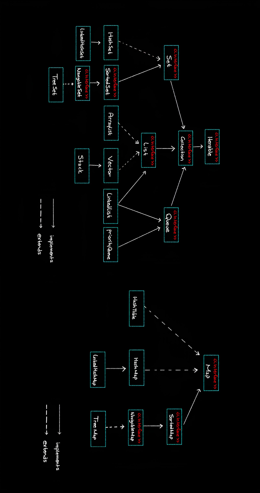
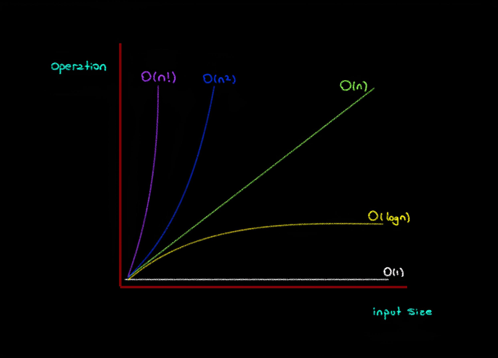

# Collection Framework & Big O Notation

 

### Collection Framework

- `Collection Framework`, Java'da veri toplama ve işleme işlemlerini düzenlemek ve kolaylaştırmak için kullanılan bir araçlar koleksiyonudur. Bu koleksiyonlar, programlarınızda verileri daha verimli bir şekilde yönetmenize yardımcı olur.

 

### Big O Notation

- `Big O Notation`, algoritmaların veri boyutları büyüdükçe nasıl performans göstereceğini tahmin etmek ve karşılaştırmak için kullanılır. Daha iyi bir performansa sahip algoritmalar genellikle daha düşük bir Big O karmaşıklığına sahiptir. Bu nedenle, algoritma seçiminde Big O Notation'ı anlamak önemlidir, çünkü bu, veri işleme uygulamalarının hızlı ve verimli bir şekilde çalışmasını sağlar.

 

## Download

`Collection Framework ve Big O Notation` konularını daha detaylı incelemek için aşağıdaki dosyaya göz atabilirsiniz:

> [✅Click to Download✅](https://github.com/furkankayam/bigo/raw/master/files/CollectionFramework&BigONotation.zip)

 

# License

This project is licensed under the MIT License. See the [LICENSE](LICENSE) file for details

Created by [Mehmet Furkan KAYA](https://www.linkedin.com/in/mehmet-furkan-kaya/)
